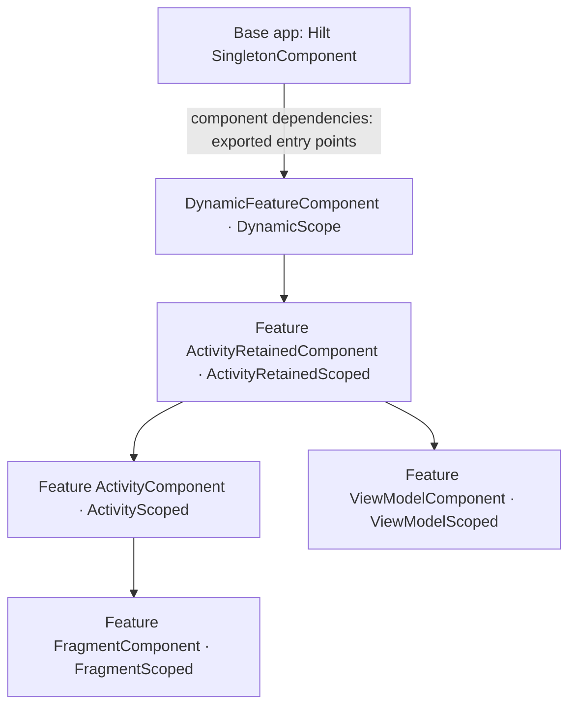

# Hilt Dynamic

An experimental companion library that adds dependency injection to Android dynamic feature modules in an existing Hilt app.

The base app uses normal Hilt. A feature adds this library's runtime, annotation processor, and Gradle plugin, then declares its dependencies and Android entry points. The library generates the Dagger graph, lifecycle managers, and injection calls.

This repository includes a working base app and install-time dynamic feature. It targets **Hilt/Dagger 2.60.1**, **AGP 9.3.2**, **Gradle 9.6.1**, and **Android API 23+**. Use **JDK 21** and Android SDK 36 to build it. Kotlin uses AGP's built-in support with `com.android.legacy-kapt`.

## Why a separate graph?

The base app cannot reference classes from a dynamic feature at compile time. Consequently, its Hilt component cannot contain the feature's bindings. Android recommends [component dependencies through Hilt entry points](https://developer.android.com/training/dependency-injection/hilt-multi-module) for this boundary.

Hilt Dynamic automates that approach. Base-app bindings cross the boundary only through explicitly exported `@EntryPoint` interfaces. The feature's generated components and implementations stay in the feature split.



There is no fork or patched version of Dagger/Hilt. The processor uses JavaPoet and standard annotation-processing APIs, and delegates graph validation and implementation to Dagger.

## Try the sample

Set `ANDROID_HOME` or add your SDK path to `local.properties`, and use JDK 21.

```sh
bash gradlew :app:bundleDebug :feature:assembleDebug
bash gradlew :dynamic-compiler:test :dynamic-gradle-plugin:test
bash gradlew :feature:connectedDebugAndroidTest
```

The last command requires an authorized device or emulator. It installs the base app, feature split, and test APK together. For manual use, run the `app` configuration in Android Studio with the `feature` dynamic feature selected, then tap **Open injected dynamic feature**.

The sample injects a singleton token exported by the base app, feature-local bindings, activity and fragment state, and a `@HiltViewModel` with a `SavedStateHandle`.

## Add it to an existing Hilt app

### 1. Build the library artifacts

These snapshots are not published to Maven Central or the Gradle Plugin Portal. Publish them locally from this checkout:

```sh
bash gradlew :hilt-dynamic:publishToMavenLocal \
  :dynamic-compiler:publishToMavenLocal \
  :dynamic-gradle-plugin:publishToMavenLocal
```

Add `mavenLocal()` to both `pluginManagement.repositories` and `dependencyResolutionManagement.repositories` in the consuming project's settings. Keep `google()`, `mavenCentral()`, and the plugin portal as appropriate.

Alternatively, `publishAllPublicationsToLocalBuildRepository` for those three projects writes all artifacts and plugin markers into this checkout's `build/repo`.

### 2. Keep the base app's normal Hilt setup

Keep `@HiltAndroidApp`, the official Hilt Gradle plugin, `hilt-android`, and `hilt-compiler` in the base app. Export the dependencies the feature needs from that app or one of its regular library dependencies:

```kotlin
@EntryPoint
@InstallIn(SingletonComponent::class)
interface FeatureDependencies {
    fun repository(): Repository
}
```

Bindings retain their original qualifiers and scope. For example, an exported singleton is the same object in the base app and feature.

Export application-specific dependencies here; the library supplies the built-in application and context bindings.

### 3. Configure the dynamic feature

Using Kotlin DSL:

```kotlin
plugins {
    id("com.android.dynamic-feature")
    id("com.android.legacy-kapt")
    id("dev.forcetower.hilt.dynamic") version "0.1.0-SNAPSHOT"
}

kapt {
    correctErrorTypes = true
}

dependencies {
    implementation(project(":app"))
    implementation("dev.forcetower.hilt:hilt-dynamic:0.1.0-SNAPSHOT")
    kapt("dev.forcetower.hilt:dynamic-compiler:0.1.0-SNAPSHOT")
    kapt("com.google.dagger:dagger-compiler:2.60.1")
}
```

Apply the official Hilt plugin and compiler in the **base app**; apply the dynamic plugin and processor above in the **feature**. The feature uses Dagger's compiler alongside the dynamic processor. Keep all Dagger and Hilt artifacts on the same version.

### 4. Declare one feature root

```kotlin
import dev.forcetower.hilt.android.dynamic.DeclareHiltDynamicFeature

@DeclareHiltDynamicFeature(dependencies = [FeatureDependencies::class])
abstract class MyFeature
```

There must be exactly one declaration per feature compilation. Multiple dependency interfaces are supported, provided they do not export conflicting bindings. Each must be a public Hilt entry point installed in the base app's `SingletonComponent`.

### 5. Annotate activities and fragments

```kotlin
import dev.forcetower.hilt.android.dynamic.DynamicAndroidEntryPoint

@DynamicAndroidEntryPoint
class FeatureActivity : AppCompatActivity() {
    @Inject lateinit var repository: Repository

    override fun onCreate(savedInstanceState: Bundle?) {
        super.onCreate(savedInstanceState)
        // Injected fields are available here.
    }
}

@DynamicAndroidEntryPoint
class FeatureFragment : Fragment() {
    @Inject lateinit var repository: Repository
}
```

The plugin rewrites the superclass to the generated injection base. A feature fragment can be hosted by the base app's ordinary `@AndroidEntryPoint` activity; that activity does not need to adopt a feature-specific base class.

For Java projects, use `annotationProcessor` in place of `kapt`. Without the dynamic plugin, the explicit form is `@DynamicAndroidEntryPoint(AppCompatActivity.class)` with a superclass of `DynamicHilt_FeatureActivity`.

### 6. Use feature modules, scopes, and ViewModels

```kotlin
import dev.forcetower.hilt.android.dynamic.components.DynamicFeatureComponent
import dev.forcetower.hilt.android.dynamic.scopes.DynamicScope

@Module
@InstallIn(DynamicFeatureComponent::class)
object FeatureModule {
    @Provides
    @DynamicScope
    fun featureService(repository: Repository): FeatureService =
        FeatureService(repository)
}

@HiltViewModel
class FeatureViewModel @Inject constructor(
    val service: FeatureService,
    val state: SavedStateHandle
) : ViewModel()
```

Retrieve ViewModels through `ViewModelProvider` or AndroidX's normal ViewModel delegates. The generated activity/fragment supplies the factory. Non-Hilt ViewModels are delegated to the AndroidX factory.

| Install target in feature source | Scope | Lifetime |
| --- | --- | --- |
| `DynamicFeatureComponent` | `@DynamicScope` | One graph per feature and Application, created on first use |
| Hilt `ActivityRetainedComponent` | `@ActivityRetainedScoped` | One host activity across configuration changes |
| Hilt `ActivityComponent` | `@ActivityScoped` | One host activity instance |
| Hilt `FragmentComponent` | `@FragmentScoped` | One fragment instance |
| Hilt `ViewModelComponent` | `@ViewModelScoped` | One ViewModel instance |

`Application`, `@ApplicationContext Context`, `Activity`, `@ActivityContext Context`, `Fragment`, `SavedStateHandle`, `ActivityRetainedLifecycle`, and `ViewModelLifecycle` are available at their respective levels. Feature `@EntryPoint` interfaces installed in the supported components can be accessed with Hilt's `EntryPoints.get`.

Feature activity and retained scopes are **separate from the base app's Hilt activity and retained scopes**, even when they share a host activity. Only the declared singleton entry points bridge the graphs.

## Current boundaries

- Activities must extend AndroidX `ComponentActivity`; fragments must extend AndroidX `Fragment`. Services, receivers, injected views, and custom component hierarchies are not implemented.
- Android entry points must be public, non-generic classes; nested classes must be static. Their base classes must be non-final and non-generic. Annotated entry-point inheritance and retained fragments are rejected. Kotlin default-argument super constructors require explicit inheritance from the generated base instead of bytecode rewriting.
- The processor supports javac and kapt, not KSP. It currently performs a full aggregation pass rather than claiming incremental processing.
- `@InstallIn` modules, feature entry points, and `@HiltViewModel` declarations are collected from the current feature compilation. There is no automatic classpath aggregation of feature library modules. Include a library's Dagger modules through a feature-local `@Module(includes = [...])` installed in the desired component.
- Feature-local singleton bindings use `@DynamicScope` and `DynamicFeatureComponent`. Put app-wide `@Singleton` bindings in the base app and export them.
- ViewModels support constructor `@Inject`, saved state, ViewModel scoping, and lifecycle callbacks. Assisted ViewModel factories and Hilt test replacement annotations are not supported. Feature ViewModels should be obtained through a ViewModelProvider.
- The library provides injection after a split is installed. Download/install UI and Play Feature Delivery integration remain the app's responsibility. The sample uses install-time delivery.
- Only the toolchain above is verified. This is an experimental implementation, not full Hilt feature parity.

## Validation

The repository has processor diagnostic tests, a bytecode transformation test, and device integration tests. The device suite was verified on a **Pixel 9 Pro XL running Android 17**, using the real base and feature APKs. It checks:

- Base-app dependency identity and feature-local module injection.
- Activity and fragment injection, including a base-app Hilt activity hosting feature fragments.
- Feature, retained, activity, fragment, and ViewModel scope boundaries.
- Activity recreation and retained lifecycle cleanup.
- Hilt ViewModel creation, saved-state defaults, keyed ViewModels, and fallback to ordinary ViewModels.
- Explicit generated-base inheritance and Hilt entry-point access to feature components.

`app:bundleDebug` produces an Android App Bundle containing both modules. `app:lintDebug` and `hilt-dynamic:lintDebug` run the Android lint checks.

The published runtime AAR, compiler JAR, and plugin marker were also verified together from a separate consuming Gradle build using the local Maven repository.
